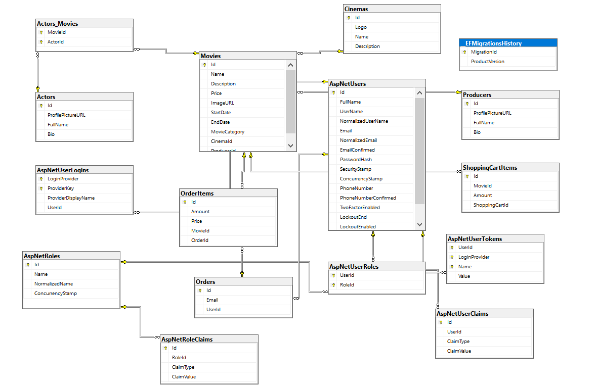
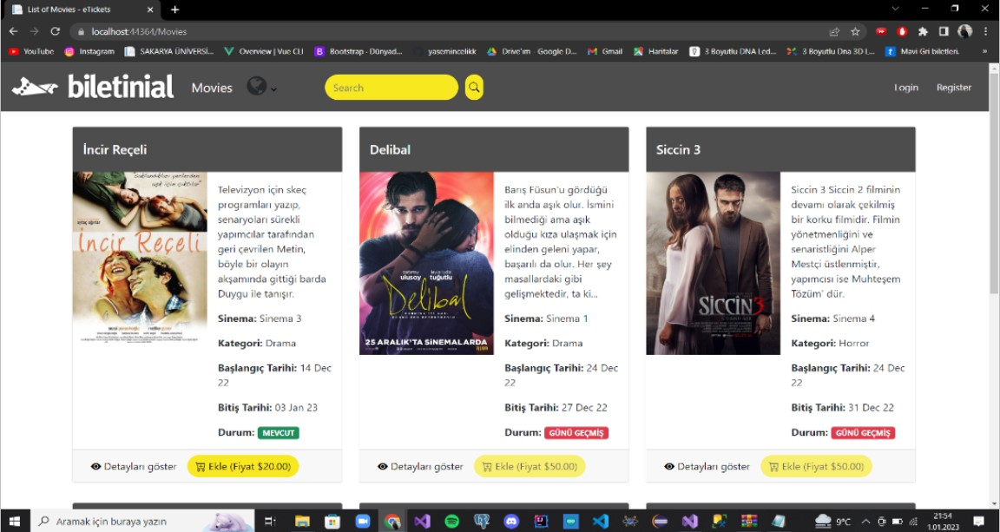

# Web Programlama Proje Ödevi

 ### Öğrenci İsimleri:
 
- b201210068 Yasemin Çelik
- b201210026 Şeyma Altıok
## 1.PROJE TANITIMI:
 
-Bu projede Asp.Net Core 6 MVC , C# , Entity Framework Core ORM , Bootstrap
Tema , HTML5, CSS3, Javascript ve Veritabanı olarak da SQL Server kullanıldı.

-Bu projede film bileti alma uygulaması geliştirdik.

-Projede admin paneli ve kullanıcıların üye olacakları sayfalar bulunmaktadır.

-Admin dışındaki kullanıcılar kayıt olabilir. Kayıt olduktan sonra film bileti satın
alma ve filmleri inceleme gibi işlemleri gerçekleştirebilir.

-Admin ise film, yapımcı, aktör ve sinema kategorilerine ; ekleme, çıkarma, detaylı
görüntüleme ve silme gibi işlemleri gerçekleştirebilir. (Admin için kullanıcı adı :
b201210068@sakarya.edu.tr) ve Şifre: Sau.12)

-Admin kullanıcıların bilgilerini görüntüleyebilir.

-Projede çoklu dil desteği bulunmaktadır.

-Projede LINQ’ nun kullanıldığı bir api hizmeti sunulmaktadır.

## 2. VERİ TABANI MODELİ:

-Projenin veri tabanı diyagramı aşağıdaki gibidir.

-Bire-bir , çoka-çok, bire-çok bağlantıları bulunmaktadır.

-16 tane tablo bulunmaktadır.

-Tablolarda primary key olarak id değerleri kullanılmıştır.

## 3. PROJE'NİN GENEL GÖRÜNÜMÜ :

